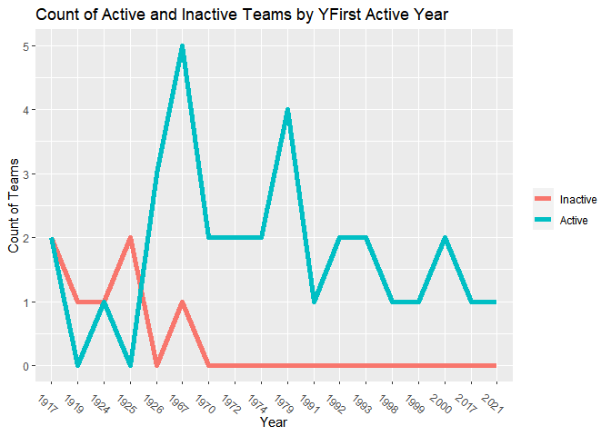
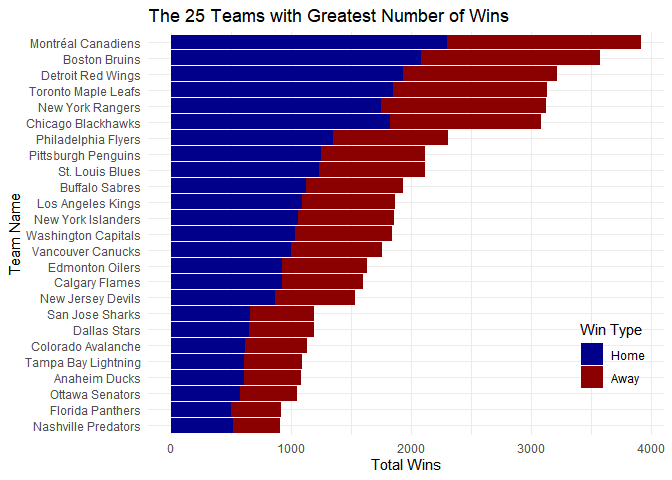
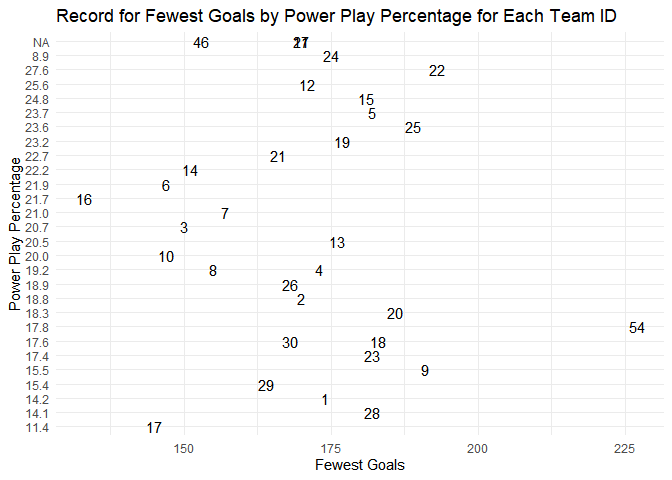
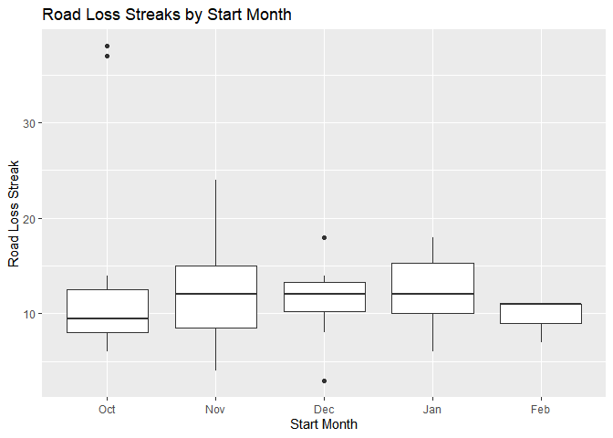
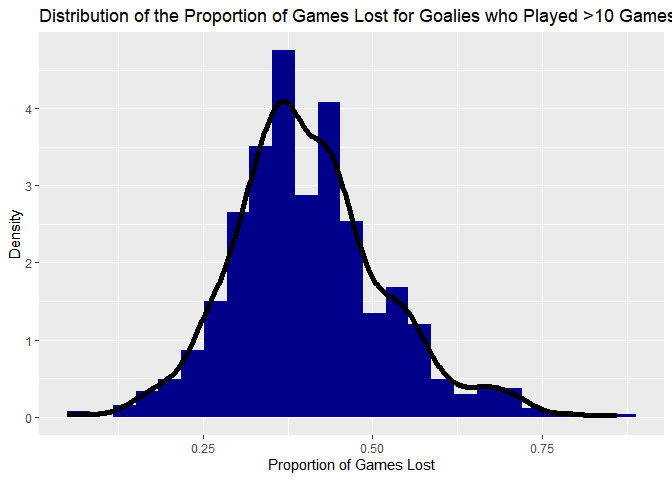
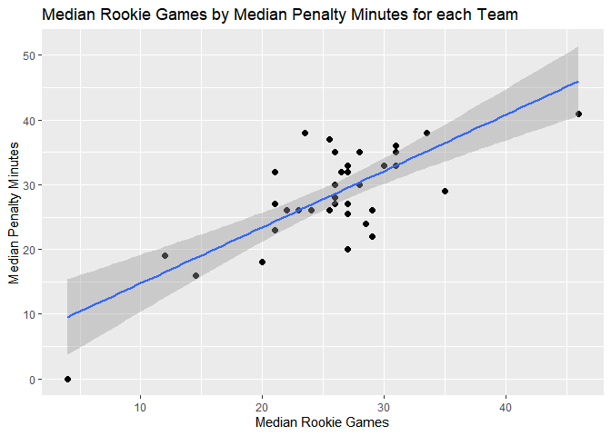

Project 1 - Accessing API’s Vignette
================
Crista Gregg
6/10/2021

-   [List of Required Packages](#list-of-required-packages)
-   [Functions to access API’s](#functions-to-access-apis)
    -   [Franchise Function](#franchise-function)
    -   [Franchise team totals
        Function](#franchise-team-totals-function)
    -   [Records Function](#records-function)
    -   [Franchise Details Function](#franchise-details-function)
    -   [Franchise Stats and Rankings
        Function](#franchise-stats-and-rankings-function)
    -   [Wrapper Function](#wrapper-function)
-   [Exploratory Data Analysis](#exploratory-data-analysis)
    -   [Contingency Tables](#contingency-tables)
        -   [One-way Contingency Table](#one-way-contingency-table)
        -   [Two-way contingency Table](#two-way-contingency-table)
    -   [Visuals](#visuals)
        -   [Line Chart Visualizing Contigency Table from
            Above](#line-chart-visualizing-contigency-table-from-above)
        -   [Bar Plot exploring Team
            Wins](#bar-plot-exploring-team-wins)
        -   [Scatter Plot of Fewest Goals by Power Play Percentage with
            Text Labels for each Team
            ID](#scatter-plot-of-fewest-goals-by-power-play-percentage-with-text-labels-for-each-team-id)
        -   [Box plot for Number of Road Loss Streaks by Starting
            Month](#box-plot-for-number-of-road-loss-streaks-by-starting-month)
        -   [Histogram of the Distribution of the Proportion of losses
            per game for
            Goalies](#histogram-of-the-distribution-of-the-proportion-of-losses-per-game-for-goalies)
        -   [Scatter plot showing median penalty minutes by median
            rookie
            games](#scatter-plot-showing-median-penalty-minutes-by-median-rookie-games)

# List of Required Packages

``` r
library(httr)
library(jsonlite)
library(tidyverse)
library(lubridate)
library(knitr)
```

# Functions to access API’s

## Franchise Function

``` r
get_franchise <- function(team_id = NA, team_name = NA){
  #connect to API
  get_endpoint <- GET('https://records.nhl.com/site/api/franchise') %>%
    content("text", encoding = 'UTF-8') %>%
    fromJSON(flatten = T) 
  df1 <- get_endpoint$data
  
  #if else statement to get team by name or ID
  ifelse(is.na(team_id) & is.na(team_name), franchise <- df1, 
         ifelse(is.na(team_id) & is.na(team_name) == FALSE, franchise <- filter(df1, fullName == team_name),
                ifelse(is.na(team_id) == FALSE & is.na(team_name), franchise <- filter(df1, id == team_id), 
                       franchise <- filter(df1, id == team_id | fullName == team_name)                                                         ))                                                         )
  return(franchise)
}

get_franchise(3, team_name = 'Montreal Wanderers')
```

    ##   id firstSeasonId           fullName lastSeasonId mostRecentTeamId teamAbbrev teamCommonName
    ## 1  2      19171918 Montreal Wanderers     19171918               41        MWN      Wanderers
    ## 2  3      19171918   St. Louis Eagles     19341935               45        SLE         Eagles
    ##   teamPlaceName
    ## 1      Montreal
    ## 2     St. Louis

## Franchise team totals Function

``` r
get_franchise_team_totals <- function(team_id = NA, team_name = NA){
  #connect to API
  get_endpoint <- GET('https://records.nhl.com/site/api/franchise-team-totals') %>%
    content("text", encoding = 'UTF-8') %>%
    fromJSON(flatten = T) 
   df1 <- get_endpoint$data
  
  #if else statement to get team by name or ID
  ifelse(is.na(team_id) & is.na(team_name), franchise_team_totals <- df1, 
         ifelse(is.na(team_id) & is.na(team_name) == FALSE, franchise_team_totals <- filter(df1, teamName == team_name),
                ifelse(is.na(team_id) == FALSE & is.na(team_name), franchise_team_totals <- filter(df1, teamId == team_id), 
                       franchise_team_totals <- filter(df1, teamId == team_id | teamName == team_name)                                                         ))                                                         )
  return(franchise_team_totals)
}

get_franchise_team_totals(2)
```

    ##   id activeFranchise firstSeasonId franchiseId gameTypeId gamesPlayed goalsAgainst goalsFor
    ## 1  3               1      19721973          22          2        3788        11907    12045
    ## 2  4               1      19721973          22          3         308          895      982
    ##   homeLosses homeOvertimeLosses homeTies homeWins lastSeasonId losses overtimeLosses
    ## 1        678                 84      170      963           NA   1587            166
    ## 2         52                  1       NA       94           NA    138              0
    ##   penaltyMinutes pointPctg points roadLosses roadOvertimeLosses roadTies roadWins shootoutLosses
    ## 1          57792    0.5133   3889        909                 82      177      725             70
    ## 2           5687    0.0130      8         86                  2       NA       76              0
    ##   shootoutWins shutouts teamId           teamName ties triCode wins
    ## 1           86      177      2 New York Islanders  347     NYI 1688
    ## 2            0       12      2 New York Islanders   NA     NYI  170

## Records Function

``` r
#function to call from franchise season records, goalie records, or skater records.
get_franchise_records <- function(record_type , team_id = NA, team_name = NA){
  
  #stop running if incorrect type of record entered
  if (!record_type %in% c('season', 'goalie', 'skater')){
    stop("Please enter record type of 'season', 'goalie', or 'skater'")
  }
  
  #connect to API
  URL <- paste0('https://records.nhl.com/site/api/franchise-', record_type, '-records')
  endpoint <- GET(URL) %>%
    content("text", encoding = 'UTF-8') %>%
    fromJSON(flatten = T) 
   df1 <- endpoint$data
  
  #if else statement to get team by name or ID
  ifelse(is.na(team_id) & is.na(team_name), franchise_records <- df1, 
         ifelse(is.na(team_id) & is.na(team_name) == FALSE, franchise_records <- filter(df1, franchiseName == team_name),
                ifelse(is.na(team_id) == FALSE & is.na(team_name), franchise_records <- filter(df1, franchiseId == team_id), 
                       franchise_records <- filter(df1, franchiseId == team_id | franchiseName == team_name)                                                         ))                                                         )
  return(franchise_records)
}

get_franchise_records(record_type = 'skater', team_id = 2)[1:6]
```

    ##       id activePlayer assists firstName franchiseId      franchiseName
    ## 1  16889        FALSE       0     Billy           2 Montreal Wanderers
    ## 2  16897        FALSE       0     Gerry           2 Montreal Wanderers
    ## 3  16901        FALSE       1     Harry           2 Montreal Wanderers
    ## 4  16903        FALSE       0      Jack           2 Montreal Wanderers
    ## 5  16904        FALSE       1      Jack           2 Montreal Wanderers
    ## 6  16908        FALSE       0    George           2 Montreal Wanderers
    ## 7  16912        FALSE       2      Dave           2 Montreal Wanderers
    ## 8  16914        FALSE       0       Art           2 Montreal Wanderers
    ## 9  16917        FALSE       0    Raymie           2 Montreal Wanderers
    ## 10 16919        FALSE       0      Phil           2 Montreal Wanderers
    ## 11 16920        FALSE       0       Ken           2 Montreal Wanderers

## Franchise Details Function

``` r
get_franchise_detail <- function(team_id = NA){
  
  #connect to API drilling down if needed
  URL1 <- paste0('https://records.nhl.com/site/api/franchise-detail')
  URL2 <- paste0('https://records.nhl.com/site/api/franchise-detail?cayenneExp=mostRecentTeamId=', as.character(team_id))
  
  ifelse(is.na(team_id), URL <- URL1, URL <- URL2)

  endpoint <- GET(URL) %>%
    content("text", encoding = 'UTF-8') %>%
    fromJSON(flatten = T) 
  
  return(endpoint$data)
}

get_franchise_detail(10)
```

    ##   id active
    ## 1  5   TRUE
    ##                                                                                                                                                                                                                                                                                                                                                                                                                                                                                                                                                                                                                                                                                                                                                                                                                                                                                                                                                                                                                                                                                                                                                                                                                                                                                                                                                                                                                                                                                                                                                                                                                                          captainHistory
    ## 1 <ul class="striped-list">\r\n\t<li>John Tavares: 2019-20 &ndash;&nbsp;Present</li>\r\n\t<li>(No Captain): 2016-17 &ndash;&nbsp;2018-19</li>\r\n\t<li>Dion Phaneuf and (No Captain): 2015-16</li>\r\n\t<li>Dion Phaneuf: 2010-11 &ndash;&nbsp;2014-15</li>\r\n\t<li>(No Captain): 2008-09 &ndash;&nbsp;2009-10</li>\r\n\t<li>Mats Sundin: 1997-98 &ndash;&nbsp;2007-08</li>\r\n\t<li>Doug Gilmour: 1994-95 &ndash;&nbsp;1996-97</li>\r\n\t<li>Wendel Clark: 1991-92 &ndash;&nbsp;1993-94</li>\r\n\t<li>Rob Ramage: 1989-90 &ndash;&nbsp;1990-91</li>\r\n\t<li>(No Captain): 1986-87 &ndash;&nbsp;1988-89</li>\r\n\t<li>Rick Vaive: 1981-82 &ndash;&nbsp;1985-86</li>\r\n\t<li>Darryl Sittler: 1975-76 &ndash;&nbsp;1980-81</li>\r\n\t<li>Dave Keon: 1969-70 &ndash;&nbsp;1974-75</li>\r\n\t<li>George Armstrong: 1957-58 &ndash;&nbsp;1968-69</li>\r\n\t<li>Jimmy Thomson and Ted Kennedy: 1956-57</li>\r\n\t<li>Sid Smith: 1955-56</li>\r\n\t<li>Ted Kennedy: 1948-49 &ndash;&nbsp;1954-55</li>\r\n\t<li>Syl Apps: 1945-46 &ndash;&nbsp;1947-48</li>\r\n\t<li>Bob Davidson: 1943-44 &ndash;&nbsp;1944-45</li>\r\n\t<li>Syl Apps: 1940-41 &ndash;&nbsp;1942-43</li>\r\n\t<li>Red Horner: 1938-39 &ndash;&nbsp;1939-40</li>\r\n\t<li>Charlie Conacher: 1937-38</li>\r\n\t<li>Hap Day: 1927-28 &ndash;&nbsp;1936-37</li>\r\n\t<li>Bert Corbeau: 1926-27</li>\r\n\t<li>Babe Dye: 1925-26</li>\r\n\t<li>John Ross Roach: 1924-25</li>\r\n\t<li>Jack Adams: 1923-24</li>\r\n\t<li>Reg Noble and Jack Adams: 1922-23</li>\r\n\t<li>Reg Noble: 1920-21 &ndash;&nbsp;1921-22</li>\r\n\t<li>Frank Heffernan: 1919-20</li>\r\n\t<li>Ken Randall: 1917-18 &ndash;&nbsp;1918-19</li>\r\n</ul>\r\n
    ##                                                                                                                                                                                                                                                                                                                                                                                                                                                                                                                                                                                                                                                                                                                                                                                                                                                                                                                                                                                                                                                                                                                                                                                                                                                                                                                                                                                                                                                                                                                                                                                                                                                                                                                                                                                                                                                                                                                                                                                                                                                                                                                                                                                                                                                                                                                                                                                                                                                                                                                                                                                                                                                                                                                                                                                                                                                                                             coachingHistory
    ## 1 <ul class="striped-list">\r\n\t<li>Sheldon Keefe: Nov. 21, 2019 &ndash; Present</li>\r\n\t<li>Mike Babcock: Oct. 7, 2015 &ndash; Nov. 19, 2019</li>\r\n\t<li>Peter Horachek: Jan. 7&nbsp;&ndash; April 11, 2015</li>\r\n\t<li>Randy Carlyle: March 3, 2012 &ndash; Jan. 3, 2015</li>\r\n\t<li>Ron Wilson: Oct. 9, 2008 &ndash; Feb. 29, 2012</li>\r\n\t<li>Paul Maurice: Oct. 4, 2006 &ndash; April 5, 2008</li>\r\n\t<li>Pat Quinn: Oct. 10, 1998 &ndash; April 18, 2006</li>\r\n\t<li>Mike Murphy: Oct. 5, 1996 &ndash; April 19, 1998</li>\r\n\t<li>Nick Beverley: March 6&nbsp;&ndash; April 27, 1996</li>\r\n\t<li>Pat Burns: Oct. 7, 1992 &ndash; March 3, 1996</li>\r\n\t<li>Tom Watt: Oct. 27, 1990 &ndash; April 15, 1992</li>\r\n\t<li>Doug Carpenter: Oct. 5, 1989 &ndash; Oct. 25, 1990</li>\r\n\t<li>George Armstrong: Dec. 19, 1988 &ndash; April 2, 1989</li>\r\n\t<li>John Brophy: Oct. 9, 1986 &ndash; Dec. 17, 1988</li>\r\n\t<li>Dan Maloney: Oct. 11, 1984 &ndash; April 30, 1986</li>\r\n\t<li>Mike Nykoluk: Jan. 10, 1981 &ndash; April 1, 1984</li>\r\n\t<li>Joe Crozier: Oct. 11, 1980 &ndash; Jan. 7, 1981</li>\r\n\t<li>Punch Imlach: March 19&nbsp;&ndash; April 11, 1980</li>\r\n\t<li>Dick Duff: March 15-17, 1980</li>\r\n\t<li>Floyd Smith: Oct. 10, 1979 &ndash; March 12, 1980</li>\r\n\t<li>Roger Neilson: Oct. 13, 1977 &ndash; April 22, 1979</li>\r\n\t<li>Red Kelly: Oct. 10, 1973 &ndash; April 21, 1977</li>\r\n\t<li>John McLellan: Oct. 11, 1969 &ndash; April 1, 1973</li>\r\n\t<li>Punch Imlach: Nov. 29, 1958 &ndash; April 6, 1969</li>\r\n\t<li>Billy Reay: Oct. 8, 1957 &ndash; Nov. 27, 1958</li>\r\n\t<li>Howie Meeker: Oct. 11, 1956 &ndash; March 24, 1957</li>\r\n\t<li>King Clancy: Oct. 10, 1953 &ndash; March 29, 1956</li>\r\n\t<li>Joe Primeau: Oct. 14, 1950 &ndash; March 22, 1953</li>\r\n\t<li>Hap Day: Nov. 2, 1940 &ndash; April 9, 1950</li>\r\n\t<li>Dick Irvin: Dec. 1, 1931 &ndash; April 13, 1940</li>\r\n\t<li>Conn Smythe: Nov. 28, 1931</li>\r\n\t<li>Art Duncan: Nov. 18, 1930 &ndash; Nov. 26, 1931</li>\r\n\t<li>Conn Smythe: Nov. 15, 1927 &ndash; Nov. 15, 1930</li>\r\n\t<li>Alex Romeril: Feb. 17&nbsp;&ndash; March 26, 1927</li>\r\n\t<li>Mike Rodden: Feb. 12-15, 1927</li>\r\n\t<li>Charles Querrie: Nov. 17, 1926 &ndash; Feb. 10, 1927</li>\r\n\t<li>Eddie Powers: Nov. 29, 1924 &ndash; March 17, 1926</li>\r\n\t<li>Charles Querrie: Jan. 3, 1923 &ndash; March 5, 1924</li>\r\n\t<li>George O&#39;Donoghue: Dec. 17, 1921 &ndash; Dec. 30, 1922</li>\r\n\t<li>Frank Carroll: Dec. 22, 1920 &ndash; March 14, 1921</li>\r\n\t<li>Harvey Sproule: Feb. 4&nbsp;&ndash; March 13, 1920</li>\r\n\t<li>Frank Heffernan: Dec. 23, 1919 &ndash; Jan. 31, 1920</li>\r\n\t<li>Dick Carroll: Dec. 19, 1917 &ndash; Feb. 20, 1919</li>\r\n\t<li>* <em>Date range indicates first and last games coached during tenure (regular season or playoffs)</em></li>\r\n</ul>\r\n
    ##           dateAwarded                                   directoryUrl firstSeasonId
    ## 1 1917-11-26T00:00:00 https://www.nhl.com/mapleleafs/team/management      19171918
    ##                                                                                                                                                                                                                                                                                                                                                                                                                                                                                                                                                                                                                                                                                                                                                                                                                                                                                                                                                                                                                                                                                                                                                                                                                                                                                                                                                                                                                                                                                                                                         generalManagerHistory
    ## 1 <ul class="striped-list">\r\n\t<li>Kyle Dubas: May 11, 2018 &ndash; Present</li>\r\n\t<li>Lou Lamoriello: July 23, 2015 &ndash; April 30, 2018</li>\r\n\t<li>Dave Nonis: Jan. 9, 2013 &ndash; April 12, 2015</li>\r\n\t<li>Brian Burke: Nov. 29, 2008 &ndash; Jan. 9, 2013</li>\r\n\t<li>Cliff Fletcher: Jan. 22&nbsp;&ndash; Nov. 29, 2008</li>\r\n\t<li>John Ferguson Jr.: Aug. 29, 2003 &ndash; Jan. 22, 2008</li>\r\n\t<li>Pat Quinn: July 15, 1999 &ndash; Aug. 29, 2003</li>\r\n\t<li>Ken Dryden: Aug. 21, 1997 &ndash; July 15, 1999</li>\r\n\t<li>Bill Watters: May 25&nbsp;&ndash; Aug. 21, 1997</li>\r\n\t<li>Cliff Fletcher: July 1, 1991 &ndash; May 25, 1997</li>\r\n\t<li>Floyd Smith: Aug. 15, 1989 &ndash; July 1, 1991</li>\r\n\t<li>Gord Stellick: April 28, 1988 &ndash; Aug. 11, 1989</li>\r\n\t<li>John Brophy, Dick Duff and Gord Stellick: Feb. 7&nbsp;&ndash; April 28, 1988</li>\r\n\t<li>Gerry McNamara: Oct. 26, 1981 &ndash; Feb. 7, 1988</li>\r\n\t<li>Punch Imlach: July 4, 1979 &ndash; Oct. 26, 1981</li>\r\n\t<li>Jim Gregory: April 6, 1969 &ndash; July 4, 1979</li>\r\n\t<li>Punch Imlach: Nov. 21, 1958 &ndash; April 6, 1969</li>\r\n\t<li>Stafford Smythe: Oct. 3, 1957 &ndash; Nov. 21, 1958</li>\r\n\t<li>Howie Meeker: May 13&nbsp;&ndash; Oct. 3, 1957</li>\r\n\t<li>Hap Day: Oct. 8, 1954 &ndash; March 25, 1957</li>\r\n\t<li>Conn Smythe: Nov. 15, 1927 &ndash; Oct. 8, 1954</li>\r\n\t<li>Charles Querrie: 1917 &ndash; Feb. 14, 1927</li>\r\n\t<li>* <em>Date range indicates first and last days of tenure</em></li>\r\n</ul>\r\n
    ##                                                                           heroImageUrl
    ## 1 https://records.nhl.com/site/asset/public/ext/hero/Team Pages/TOR/MatthewsMarner.jpg
    ##   mostRecentTeamId
    ## 1               10
    ##                                                                                                                                                                                                                                                                                                                                                                                                                                                                                                                                                                                                                                                                                                                                                                                                                                                                                                                                                                                                                                                                                              retiredNumbersSummary
    ## 1 <ul class="striped-list">\r\n\t<li>1 &ndash;&nbsp;Turk Broda (1936-43, 1945-52)</li>\r\n\t<li>1 &ndash;&nbsp;Johnny Bower (1958-70)</li>\r\n\t<li>4 &ndash;&nbsp;Hap Day (1926-37)</li>\r\n\t<li>4 &ndash;&nbsp;Red Kelly (1959-67)</li>\r\n\t<li>5 &ndash;&nbsp;Bill Barilko (1946-51)</li>\r\n\t<li>6 &ndash;&nbsp;Ace Bailey (1926-34)</li>\r\n\t<li>7 &ndash;&nbsp;King Clancy (1930-37)</li>\r\n\t<li>7 &ndash;&nbsp;Tim Horton (1949-50, 1951-70)</li>\r\n\t<li>9 &ndash;&nbsp;Charlie Conacher (1929-38)</li>\r\n\t<li>9 &ndash;&nbsp;Ted Kennedy (1942-55, 1956-57)</li>\r\n\t<li>10 &ndash;&nbsp;Syl Apps (1936-43, 1945-48)</li>\r\n\t<li>10 &ndash;&nbsp;George Armstrong (1949-50, 1951-71)</li>\r\n\t<li>13 &ndash;&nbsp;Mats Sundin (1994-08)</li>\r\n\t<li>14 &ndash;&nbsp;Dave Keon (1960-75)</li>\r\n\t<li>17 &ndash;&nbsp;Wendel Clark (1985-94, 1996-98, 2000)</li>\r\n\t<li>21 &ndash;&nbsp;Borje Salming (1973-89)</li>\r\n\t<li>27 &ndash;&nbsp;Frank Mahovlich (1956-68)</li>\r\n\t<li>27 &ndash;&nbsp;Darryl Sittler (1970-82)</li>\r\n\t<li>93 &ndash;&nbsp;Doug Gilmour (1992-97, 2003)</li>\r\n</ul>\r\n
    ##   teamAbbrev        teamFullName
    ## 1        TOR Toronto Maple Leafs

## Franchise Stats and Rankings Function

``` r
get_team_stats <- function(team_id = 'All', team_name = NA){

if (team_id == 'All'){
#teams info to show where individual team info is located
get_endpoint_all <- GET('https://statsapi.web.nhl.com/api/v1/teams/') %>%
    content("text", encoding = 'UTF-8') %>%
    fromJSON(flatten = T) 

#use URL pulled from get_endpoint_all to grab data from all teams and then combine
URL_combine <- paste0('https://statsapi.web.nhl.com/api/v1/teams/', as.character(get_endpoint_all$teams$id), '/stats')
#get all team info
team_stats_combined_single_season <- team_stats_combined_rankings <- vector("list", length(URL_combine))

  for (i in 1:length(URL_combine)){
    team_stat <- GET(URL_combine[i]) %>%
      content("text", encoding = 'UTF-8') %>%
      fromJSON(flatten = T) 
   team_stats_combined_single_season[[i]] <- team_stat$stats$splits[[1]]
   team_stats_combined_rankings[[i]] <- team_stat$stats$splits[[2]]
  }
team_stats_combined_single_season <- bind_rows(team_stats_combined_single_season)
team_stats_combined_rankings <- bind_rows(team_stats_combined_rankings)

final <- list(single_season = team_stats_combined_single_season, rankings = team_stats_combined_rankings)
if (is.na(team_name)) return(final)
  else return(list(single_season = filter(team_stats_combined_single_season, team.name == team_name), rankings = filter(team_stats_combined_rankings, team.name == team_name)))

} else {
#if specific team wanted
  URL <- paste0('https://statsapi.web.nhl.com/api/v1/teams/', as.character(team_id), '/stats')
  get_endpoint <- GET(URL) %>%
      content("text", encoding = 'UTF-8') %>%
      fromJSON(flatten = T) 
  single_season <- get_endpoint$stats$splits[[1]] %>% 
    select(team.id, team.name, everything())
  rankings <- get_endpoint$stats$splits[[2]] %>% 
    select(team.id, team.name, everything())
  
  final <- list(single_season = single_season, rankings = rankings)
  return(final)
}
}

#get_team_stats()
#get_team_stats(team_id = 1)
get_team_stats(team_name = 'New York Islanders')
```

    ## $single_season
    ##   stat.gamesPlayed stat.wins stat.losses stat.ot stat.pts stat.ptPctg stat.goalsPerGame
    ## 1               56        32          17       7       71        63.4             2.714
    ##   stat.goalsAgainstPerGame stat.evGGARatio stat.powerPlayPercentage stat.powerPlayGoals
    ## 1                    2.232          1.2418                     18.8                  27
    ##   stat.powerPlayGoalsAgainst stat.powerPlayOpportunities stat.penaltyKillPercentage
    ## 1                         22                         144                       83.7
    ##   stat.shotsPerGame stat.shotsAllowed stat.winScoreFirst stat.winOppScoreFirst
    ## 1           28.9821           28.3929              0.821                 0.321
    ##   stat.winLeadFirstPer stat.winLeadSecondPer stat.winOutshootOpp stat.winOutshotByOpp
    ## 1                0.833                 0.842                0.69                 0.44
    ##   stat.faceOffsTaken stat.faceOffsWon stat.faceOffsLost stat.faceOffWinPercentage
    ## 1               2916             1498              1418                      51.4
    ##   stat.shootingPctg stat.savePctg team.id          team.name       team.link
    ## 1               9.4         0.921       2 New York Islanders /api/v1/teams/2
    ## 
    ## $rankings
    ##   stat.wins stat.losses stat.ot stat.pts stat.ptPctg stat.goalsPerGame stat.goalsAgainstPerGame
    ## 1      12th        11th    11th     12th        12th              21st                      2nd
    ##   stat.evGGARatio stat.powerPlayPercentage stat.powerPlayGoals stat.powerPlayGoalsAgainst
    ## 1             7th                     20th                24th                        2nd
    ##   stat.powerPlayOpportunities stat.penaltyKillOpportunities stat.penaltyKillPercentage
    ## 1                        28th                           2nd                        6th
    ##   stat.shotsPerGame stat.shotsAllowed stat.winScoreFirst stat.winOppScoreFirst
    ## 1              22nd              10th               10th                  16th
    ##   stat.winLeadFirstPer stat.winLeadSecondPer stat.winOutshootOpp stat.winOutshotByOpp
    ## 1                  7th                  20th                 4th                  4th
    ##   stat.faceOffsTaken stat.faceOffsWon stat.faceOffsLost stat.faceOffWinPercentage
    ## 1               31st             25th               2nd                       9th
    ##   stat.savePctRank stat.shootingPctRank team.id          team.name       team.link
    ## 1              1st                 17th       2 New York Islanders /api/v1/teams/2

## Wrapper Function

All functions have team\_id and team\_name as arguments to obtain
desired record.

``` r
get_endpoint <- function(endpoint = c('franchise', 'team totals', 'records', 'details', 'stats'), ...){
  ifelse(endpoint == 'franchise', return(get_franchise(...)),
      ifelse(endpoint == 'team totals', return(get_franchise_team_totals(...)),
           ifelse(endpoint == 'records', return(get_franchise_records(...)),
                  ifelse(endpoint == 'details', return(get_franchise_detail(...)),
                         ifelse(endpoint == 'stats', return(get_team_stats(...)))))))
}

get_endpoint('team totals', team_id = 7)
```

    ##   id activeFranchise firstSeasonId franchiseId gameTypeId gamesPlayed goalsAgainst goalsFor
    ## 1 13               1      19701971          19          2        3945        11966    12471
    ## 2 14               1      19701971          19          3         256          765      763
    ##   homeLosses homeOvertimeLosses homeTies homeWins lastSeasonId losses overtimeLosses
    ## 1        639                 84      197     1053           NA   1564            167
    ## 2         54                  0       NA       73           NA    132              0
    ##   penaltyMinutes pointPctg points roadLosses roadOvertimeLosses roadTies roadWins shootoutLosses
    ## 1          60671    0.5305   4186        925                 83      212      752             74
    ## 2           4692    0.0000      0         78                  0       NA       51              0
    ##   shootoutWins shutouts teamId       teamName ties triCode wins
    ## 1           81      194      7 Buffalo Sabres  409     BUF 1805
    ## 2            0       18      7 Buffalo Sabres   NA     BUF  124

# Exploratory Data Analysis

Now I can easily pull data from several of the API endpoints. I will now
perform an Exploratory Data Analysis.

## Contingency Tables

### One-way Contingency Table

``` r
details <- get_endpoint('details')
t <- table(details$active)
kable(t, col.names = c('Team Active?', 'Count'), caption = 'Count of Active Teams')
```

| Team Active? | Count |
|:-------------|------:|
| FALSE        |     7 |
| TRUE         |    32 |

Count of Active Teams

### Two-way contingency Table

``` r
activity_year <- details %>%
  separate(firstSeasonId, into = 'first_year', sep = 4) #keep first year for readability
t2 <- table(activity_year$first_year, activity_year$active)
kable(t2, caption = 'Activity of Teams by First Active Year')
```

|      | FALSE | TRUE |
|:-----|------:|-----:|
| 1917 |     2 |    2 |
| 1919 |     1 |    0 |
| 1924 |     1 |    1 |
| 1925 |     2 |    0 |
| 1926 |     0 |    3 |
| 1967 |     1 |    5 |
| 1970 |     0 |    2 |
| 1972 |     0 |    2 |
| 1974 |     0 |    2 |
| 1979 |     0 |    4 |
| 1991 |     0 |    1 |
| 1992 |     0 |    2 |
| 1993 |     0 |    2 |
| 1998 |     0 |    1 |
| 1999 |     0 |    1 |
| 2000 |     0 |    2 |
| 2017 |     0 |    1 |
| 2021 |     0 |    1 |

Activity of Teams by First Active Year

## Visuals

### Line Chart Visualizing Contigency Table from Above

``` r
t3 <- data.frame(t2) %>% #make freguency table a data frame
  rename(Year = Var1, Active = Var2)

ggplot(t3, aes(x = Year, y = Freq)) +
  geom_line(aes(group = Active, color = Active), size = 2) +
  labs(y = 'Count of Teams', title = 'Count of Active and Inactive Teams by YFirst Active Year') +
  scale_color_discrete(name = NULL, labels = c('Inactive', 'Active')) +
  theme(axis.text.x = element_text(angle = -40))
```

<!-- -->

Above we see the number of currently active and inactive teams by the
year they were first active. We see all teams in this list that are
inactive were first active before 1970. We have the most teams that were
first active in 1967.

### Bar Plot exploring Team Wins

``` r
team_totals <- get_endpoint('team totals')

team_wins <- team_totals %>%
  group_by(teamName) %>%
  summarize_at(c('wins', 'homeWins', 'roadWins'), sum, na.rm = T) %>% #add up rows by team
  arrange(desc(wins)) %>% #sort by number of wins
  head(25) %>% #only keep top 25
  ggplot(aes(reorder(teamName, wins)))
team_wins + geom_col(aes(y = wins, fill = 'darkred')) + #fill show go in aes layer so legend shows up 
  geom_col(aes(y = homeWins, fill = 'darkblue')) + #add layer to show proportion of wins that are home
  coord_flip() + 
  theme_minimal() +
  theme(legend.position = c(0.9,0.2)) +
  labs(x = 'Team Name', y = 'Total Wins', title = 'The 25 Teams with Greatest Number of Wins') +
  scale_fill_manual(name = 'Win Type', labels = c('Home', 'Away'), values = c('darkblue','darkred'))
```

<!-- -->

Here we have a bar plot of the total wins by team broken into home wins
and away wins. Only the top 25 teams are shown. The Montreal Canadiens
have the most total wins at nearly 4,000.

### Scatter Plot of Fewest Goals by Power Play Percentage with Text Labels for each Team ID

``` r
season_records <- get_endpoint('records', record_type = 'season') %>%
  rename(team.id = id)
stats <- get_endpoint('stats')[[1]] #extract first element of this list

#combine records and stats
records_stats <- left_join(season_records, stats, by = 'team.id') %>%
  select(team.id, franchiseName, everything(), -team.name)
#str(records_stats)

#create scatter plot
ggplot(records_stats, aes(fewestGoals, stat.powerPlayPercentage)) +
  geom_text(aes(label = team.id), na.rm = T) +
  labs(x = 'Fewest Goals', y = 'Power Play Percentage', title = 'Record for Fewest Goals by Power Play Percentage for Each Team ID') +
  theme_minimal()
```

<!-- -->

The graph above shows the power play percentage by fewest goals in a
season for each team. The points are labeled with the team ID for
reference. We do not see much of a relationship, but we do notice team
54 has the largest number by far for fewest goals in a season.

### Box plot for Number of Road Loss Streaks by Starting Month

``` r
season_records %>% 
  select(starts_with('roadLoss')) %>% #select relevant data
  separate(roadLossStreakDates, into = 'start_month', sep = 3) %>% #separate column so I just have start month
  filter(is.na(start_month) == F) %>%
  mutate(month_numeric = ifelse(start_month == 'Jan', 13, 
                                ifelse(start_month == 'Feb', 14, match(start_month, month.abb)))) %>% #put Jan and Feb on the end so we are looking at the correct ordering of one season
  ggplot(aes(reorder(start_month, month_numeric), roadLossStreak)) +
    geom_boxplot() +
  labs(x = 'Start Month', y = 'Road Loss Streak', title = 'Road Loss Streaks by Start Month')
```

<!-- -->

Above we have a box plot for the road loss streaks by start month
ordered by the season months from October to February. October and
December both have two outliers.

### Histogram of the Distribution of the Proportion of losses per game for Goalies

``` r
get_endpoint('records', record_type = 'goalie') %>%
  filter(gamesPlayed > 10) %>% #to cut down on those who played a just a few games and thus had extreme proportions
  transmute(losses_per_game = losses/gamesPlayed) %>% #create and keep only the new variable
  ggplot(aes(losses_per_game)) +
    geom_histogram(aes(y = ..density..), bins = 25, fill = 'darkblue') +
    geom_density(size = 2) +
    labs(x = 'Proportion of Games Lost', y = 'Density', title = 'Distribution of the Proportion of Games Lost for Goalies who Played >10 Games')
```

<!-- -->

Above is the distribution of the proportion of games lost by individual
goalies. Those who played less than 10 games were removed to avoid
extreme proportions. A density curve is overlayed on the histogram. The
mean proportion appears to be around 0.3, and the data is more or less
normally distributed, though it has a slight skew to the right.

### Scatter plot showing median penalty minutes by median rookie games

``` r
skater <- get_endpoint('records', record_type = 'skater')
skater %>%
  group_by(franchiseName) %>%
  summarise(median_penalty_minutes = median(penaltyMinutes, na.rm = T), median_rookie_games = median(rookieGamesPlayed, na.rm = T)) %>%
  ggplot(aes(median_rookie_games, median_penalty_minutes)) +
    geom_point(size = 2) +
    geom_smooth(method = lm) +
    labs(x = 'Median Rookie Games', y = 'Median Penalty Minutes', title = 'Median Rookie Games by Median Penalty Minutes for each Team')
```

    ## `geom_smooth()` using formula 'y ~ x'

<!-- -->

Finally, we have a scatter plot showing the median rookie games by the
median penalty minutes for skaters, grouped by team. We see a slight
positive trend here, as seen by the linear regression line.
